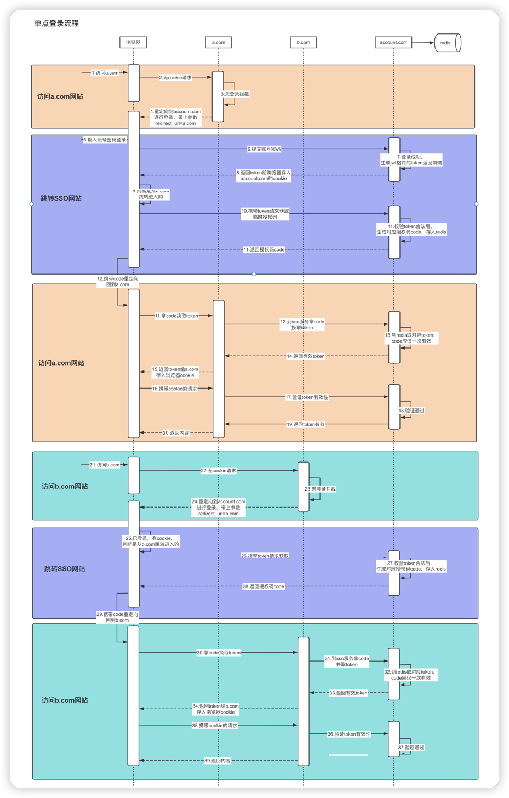

## 介绍
这是一个基于Go语言开发的SSO单点登录系统的后端Api服务，配合前端系统：[SSO前端系统](https://github.com/DJP125142/account-vue "SSO前端系统")

### 什么是单点登录？
SSO（single sign on）单点登录就是通过登录一个统一的认证服务，可以免登录不同域名下的不同站点，解决企业内部当系统太多时，切换系统需要频繁登录的问题。   

### 体验地址
[SSO_DEMO](https://account.djp.org.cn/ "出自大鸡排工作室")

## 登录流程


## 目录结构
```
├── config             # 存放配置文件的目录
│   └── config.go      # 读取配置文件的代码
│
├── controller         # 控制器目录
│   └── user.go        # 处理登录注册获取用户信息的代码
│
├── dao                # 数据库访问对象目录
│   └── user_dao.go    # 用户相关数据库操作的代码
│
├── forms              # 表单结构体目录
│   └── user.go        # 处理登录注册请求的表单结构体
│
├── global             # 全局变量目录
│   └── globalVal.go   # 存放全局变量的代码
│
├── initialize         # 初始化目录
│   └── init.go        # 初始化一些环境的代码
│
├── logs               # 存放日志文件的目录
│   └── gin.log        # Gin框架的日志文件
│
├── middlewares        # 中间件目录
│   ├── cors.go        # 处理跨域请求的中间件
│   ├── logger.go      # 处理日志打印的中间件
│   └── jwt.go         # 处理身份验证的中间件
│
├── models             # 数据库模型目录
│   └── user.go        # 用户模型的定义
│
├── response           # 响应结构体目录
│   └── response.go    # 定义响应结构体的代码
│
├── router            # 路由目录
│   └── router.go      # 路由的定义
│
├── utils              # 工具目录
│   └── util.go        # 存放一些常用的工具函数
│
├── vendor             # 依赖包目录
│
├── .gitignore         # Git忽略文件列表
├── build.sh           # 服务启动脚本
├── env.example.toml   # 存放环境变量的配置的模版文件
├── env.toml           # 存放环境变量的配置文件，从env.example.toml复制，然后修改成自己的
├── go.mod             # go mod管理依赖的配置文件
└── main.go            # 应用入口文件
```
## 部署服务
1. 拉取代码
```
git clone https://github.com/DJP125142/sso-go.git
```
2. 在根目录下复制一份env.example.toml 改名为env.toml，打开env.toml 填写你自己的配置项信息。  
```
......
// jwt的key是生成token的密钥，建议使用32位随机字符串
[jwt]
key = ""
```
3. 拉取依赖包
```
// 使用go mod 管理依赖包
go mod download
```
4. 启动项目
```
// 执行启动服务脚本
./build.sh
// 看到显示“Go服务已启动！”根目录下多处一个编译文件ssoService表示服务已启动
```

## 数据表要求
由于系统默认自带了一个完整的注册登录接口，所以要求有一个至少具备以下字段的mySql数据库users表
```
create table users
(
id                bigint unsigned auto_increment primary key,
name              varchar(191) not null,
head_url          varchar(128) null,
email             varchar(191) not null,
email_verified_at timestamp    null,
password          varchar(191) not null,
created_at        timestamp    null,
updated_at        timestamp    null,
constraint users_email_unique unique (email)
);
```

## 接口文档
| 接口名称          | 接口api | 请求方式  | 请求参数          |
|---------------| :---------- |-------|---------------|
|发送邮箱验证码	|/send_emial_code| 	POST	 |email|
|注册	|/register	| POST	 |name、email、code、password|
|登录	|/login	| POST	 |name、password|
|获取临时授权码	|/create_code	| POST	 |header头里携带Authorization，值为`Bearer ${token}`|
|外部客户端换取token	|/get_token_by_code	| POST	 |code|
|验证token	|/user	| GET	  |header头里携带Authorization，值为`Bearer ${token}`|  

详细看路由文件内接口注释和相关代码。  

## 外部客户端接入
根据SSO系统的目标场景和流程设计，SSO实际上就是将注册登录和鉴权能力抽离出一个独立的统一认证服务，这个SSO系统搭建完成后，内部任意允许的第三方业务系统都可以
快速接入。对于外部客户端接入SSO统一认证服务，只需要做2个步骤完成三件事情：

#### 1、带redirect_url参数跳转登录页 
前端在需要登录的地方，比如登录按钮，添加一个a标签，href设置为做一个跳转到搭建好的SSO登录页面  
跳转链接后面拼上?redirect_url=当前页面地址，地址记得进行encodeUrl转译

#### 2、到统一认证服务SSO网站上完成注册登录（这一步不需要业务测参与）
注册登录完成后，前端会判断来源是从业务系统跳转过来的，会自动请求后端接口生成一个临时授权码code，并重定向回来源业务网站  

#### 3、业务测网站前端接收回调换取token存在本地cookie
业务测网站前端需要做一段接收回调后换取token的逻辑：一般会在入口文件main.js中，如果地址上带有code，
拿code去请求SSO系统的换取token接口：/get_token_by_code?code=xxxxxxxx，这个步骤前端做或者后端做都行，
该接口会返回token和token对应的基本用户信息，前端将token存入本地cookie即可。

#### 4、业务测后端服务验证token有效性（可选）
这是属于业务测自己的后端鉴权服务，对于需要登录的业务请求，拿到前端的token后，如果想要验证该token是否有效，
可以请求SSO系统的 /user 接口，返回基本用户信息则说明token合法有效。
r.com前端自己要做一个逻辑：如果地址上带有code，拿code去请求https://sso.djp.org.cn/v1/account/get_token_by_code?code=xxxxxxxx，这个接口会返回登录态token，里头有用户基本信息，你自己存在本地cookie就行